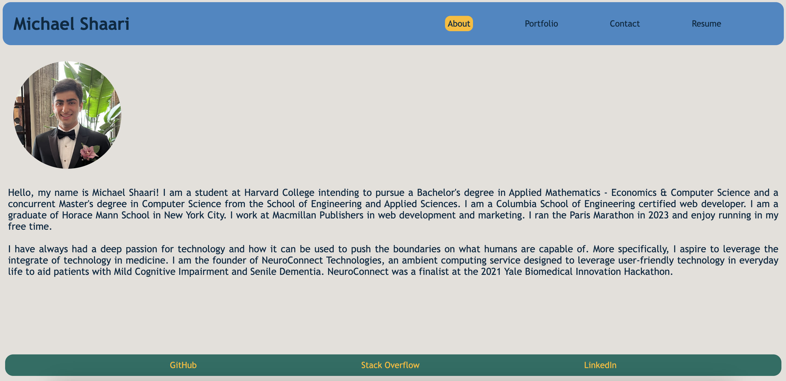

# React Portfolio
  


## Table of Contents
* [Description](#description)
* [Installation](#installation)
* [Usage](#usage)
* [Contributing](#contributing)
* [License](#license)
* [Questions](#questions)

## Description
React Portfolio is my Professional Portfolio that demonstrates my web development capabilites by displaying qualifications/work samples and by being built using the latest technologies, that is, React itself. It contains About, Header, Navigation, Project, Portfolio, Contact, and Resume components that are dynamically displayed (or integrated within other components) depending on what buttons the user clicks on. The four different pages are the About, Portfolio, Contact, and Resume pages; however, when a user navigates to any of these pages, the page changes but does not reload, and the current page is highlighted. 

The About page features a bio and headshot. The Portfolio is my web development exhibit, displaying six of my web applications with a title, image, link to the application, and link to the GitHub repository. The Contact page contains a contact form where users enter a name, email, and message and, upon submission, I receive an email with their message -- it will alert the user if they do not enter a valid input (including email validation) for any of the forms upon clicking off of the input field. Lastly, the Resume page displays my professional skills and the option to download my resume as a PDF. Every page has a Header which includes my name and a Navigation bar that highlights the current page. Each page also contains a Footer with links to my GitHub, LinkedIn, and Stack Overflow. 



## Installation
To install my React Portfolio, download [the repository](https://github.com/mshaari/react-portfolio) from GitHub by running
```
git@github.com:mshaari/react-portfolio.git
```
in your command line and open in Visual Studio Code. To install all dependencies, run
 
```
npm install
```

## Usage
To view the React Portfolio, open the root of the application in an integrated terminal and run the following command:
```
npm run start
``` 
**However, it is best and designed to skip the installation and simply visit the [deployed application](https://mshaari.github.io/react-portfolio/).**

## Contributing
Please do not contribute to this application.

## License
This application has [no license](https://choosealicense.com/no-permission).

## Questions
Please visit my GitHub profile by clicking on my username: [mshaari](https://github.com/mshaari). If you have additional questions, please email me at michael.shaari@gmail.com.